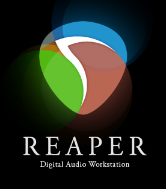

# NGMixer

<p align="center">
  <a href="https://www.reaper.fm/">
    
  </a>
  &nbsp;&nbsp;&nbsp;&nbsp;&nbsp;&nbsp;&nbsp;&nbsp;
  <a href="https://github.com/deepseek-ai/deepseek-harness">
    
  </a>
</p>

<p align="center">Mixing in REAPER · Powered by DeepSeek Harness</p>

Mix music in REAPER using natural language.

[中文](./README.md)

Tell NGMixer what you want to change. It reads your current project, measures levels and loudness, adjusts tracks and effects, and renders audio for you to hear. Give it feedback and keep refining the mix in the same project.

> “Bring the lead vocal forward, reduce the reverb, and render a mix for me to hear.”
>
> “The vocal sounds right now. Bring the drums down a little.”

Use the local WebUI, or connect QQ/NapCat to send material, listen to mixes, and give feedback in private or group chats.

## What it does

- **Analyze projects**: inspect tracks, routing, and effects; measure Peak, RMS, LUFS, and LRA.
- **Adjust mixes**: change track levels, send levels, and supported effect parameters, with undo in REAPER.
- **Import and render**: import audio, REAPER projects, or ZIP material; render 48 kHz WAV or, with FFmpeg installed, MP3.
- **Refine through feedback**: keep each rendered version with its listener feedback, use it to guide the next revision, and save personal mixing preferences.
- **Extend mixing knowledge**: load external knowledge packs to inform mixing decisions. An example pack is included.

NGMixer uses REAPER's stock effects by default and can also scan locally installed third-party plug-ins and inspect their parameters.

## Quick start

### 1. Prepare your environment

macOS is currently the primary supported platform. You will need:

| Dependency | Requirement |
| --- | --- |
| [REAPER](https://www.reaper.fm/download.php) | 7.x |
| Node.js | `>=22.19 <23` |
| Corepack / pnpm | Use the pnpm version specified by the repository |
| Model service | A model provider supported by DSH, with its credentials |
| [FFmpeg](https://ffmpeg.org/download.html) | Optional, for MP3 export and QQ media processing |

### 2. Start and configure

Clone the repository and start:

```bash
git clone https://github.com/nanaoto/NGMixer.git
cd NGMixer
corepack enable
pnpm start
```

The first launch installs dependencies automatically and opens a setup wizard. Follow the prompts to configure REAPER paths, working directories, and plug-in scan locations. Enable the QQ channel in the wizard if you want to use it.

Local settings are saved in `config/local.toml`. Once the WebUI opens, follow [Configure the LLM API](#configure-the-llm-api) below to add your provider, enter its credentials, and choose a default model. Use `pnpm start` for subsequent launches.

### 3. Connect REAPER

Open REAPER and load the `StartMixingAgentBridge.lua` script generated by the setup wizard. Its full path appears in the terminal:

`Actions → Show action list → New action… → Load ReaScript…`

Select and run the script, then check the connection from another terminal:

```bash
pnpm bridge:health
pnpm bridge:snapshot
```

### 4. Start mixing

Open a project in REAPER, then visit the WebUI address shown in the terminal, which defaults to `http://127.0.0.1:3080`. Try:

> Analyze the current project, bring the lead vocal forward, and render a WAV for me to hear.

After listening, describe what you want to change next in the same conversation.

## Configure the LLM API

Configure models directly in the DSH WebUI. The first visit shows a DeepSeek API key prompt; choose **Set up later** to use another provider. After local path setup:

1. Open the WebUI address shown in the terminal and go to **Settings → Models**.
2. Click **Add provider**, select your model provider, enter its API key, and save.
3. Choose a model in the model selector, set it as the default, and start a conversation.

Mixing plans use the default model selected in the WebUI. Changing that default takes effect on the next mixing request. Individual conversations can have their own chat model selection.

For a proxy, gateway, or self-hosted service, add a custom provider with its API address and protocol. Endpoints that support model discovery can supply a candidate list; you can also enter model IDs manually.

Model settings are stored in `var/dsh/home/settings.yaml`. API keys saved through the WebUI are stored in `.credentials.yaml` in the same directory. Both live under the Git-ignored `var/` directory and persist across restarts.

Existing `[llm.*]` sections in `config/local.toml` remain supported, including a separate mixing planner model. To switch to WebUI management, add your provider and choose a default model in the WebUI, then remove all `[llm.*]` sections from the TOML file and restart. Remove a legacy `[provider]` section as well, if present. See the [example configuration](./config/local.example.toml) for manual configuration.

## Build a mixing knowledge library from your material

The `mixing_knowledge` tool searches local knowledge packs, and the mixing planner automatically searches the same library. In a conversation, try:

> Search the knowledge library for ways to treat vocal sibilance.

**There is currently no tool that automatically turns uploaded PDFs, tutorials, web pages, or notes into a knowledge pack.** To add your material, first organize it into Markdown and register a pack:

1. Create Markdown notes grouped by topic under `knowledge/my-mixing/`, such as `00-vocal-eq.md` and `10-vocal-compression.md`. Include when the advice applies, how to assess the problem, suggested actions, and sources.
2. Create `knowledge/my-mixing/manifest.json` using the [example manifest](./knowledge/public-core/manifest.json). Set the pack's name, version, and source, plus each note's `id`, `path`, `title`, and `tags`. Replace the example document list and source information.
3. Append `{"path": "my-mixing/manifest.json"}` to the `packs` array in [knowledge/catalog.json](./knowledge/catalog.json), keeping the existing entries.
4. Ask the agent to search for a topic from your new notes and check that the relevant content is returned. Each search reads the pack files again.

Use filenames of the form `two digits-english-topic.md`. Each file must begin with a level-one heading that matches its manifest `title`. Document IDs must be unique across all packs. Each pack needs 2–64 documents, with a maximum of 16 KiB per document and 256 KiB of document text across the library. Use concise mixing notes and distill longer sources before adding them.

## Everyday commands

Run these from the project directory:

| Command | Purpose |
| --- | --- |
| `pnpm start` | Start the WebUI and enabled messaging channels |
| `pnpm doctor` | Check local paths, dependencies, and configuration |
| `pnpm bridge:health` | Check the connection to REAPER |
| `pnpm bridge:snapshot` | Inspect tracks and effects in the current project |

If a bridge request times out, make sure REAPER is open and run `StartMixingAgentBridge.lua` from the action list. If a model request fails, check the provider credentials and default model in **Settings → Models**. For a gateway, also check the API address, protocol, and model ID.

After updating the code, run `pnpm install --frozen-lockfile`, then `pnpm start`. Your local paths, model settings, and credentials will be retained.

Report problems or request features through [GitHub Issues](https://github.com/nanaoto/NGMixer/issues), including steps to reproduce, expected behavior, and actual results. Remove credentials and personal file paths from any logs you share.

## How it works

NGMixer uses DeepSeek Harness for conversation and tool calls. A TypeScript runtime reads the project and executes mixing plans through Lua scripts in REAPER. Each render is recorded as a version so that follow-up feedback refers to the mix you heard.

Mixing knowledge and personal preferences are stored separately from the model and can grow and change with use.

## Development

```bash
corepack pnpm install --frozen-lockfile
corepack pnpm check
corepack pnpm release:check
```

`pnpm check` runs tests, type checking, linting, and the build. `pnpm release:check` checks release files, sensitive data, and machine-specific paths.

| Directory | Contents |
| --- | --- |
| `src/` | TypeScript runtime, agent integration, and mixing logic |
| `reaper/` | REAPER bridge and rendering scripts |
| `knowledge/` | Mixing knowledge packs |
| `config/` | Configuration examples |
| `tests/` | Tests |

## License

Original code and documentation are available under the [MIT License](./LICENSE). See [THIRD_PARTY_NOTICES.md](./THIRD_PARTY_NOTICES.md) for third-party components.
